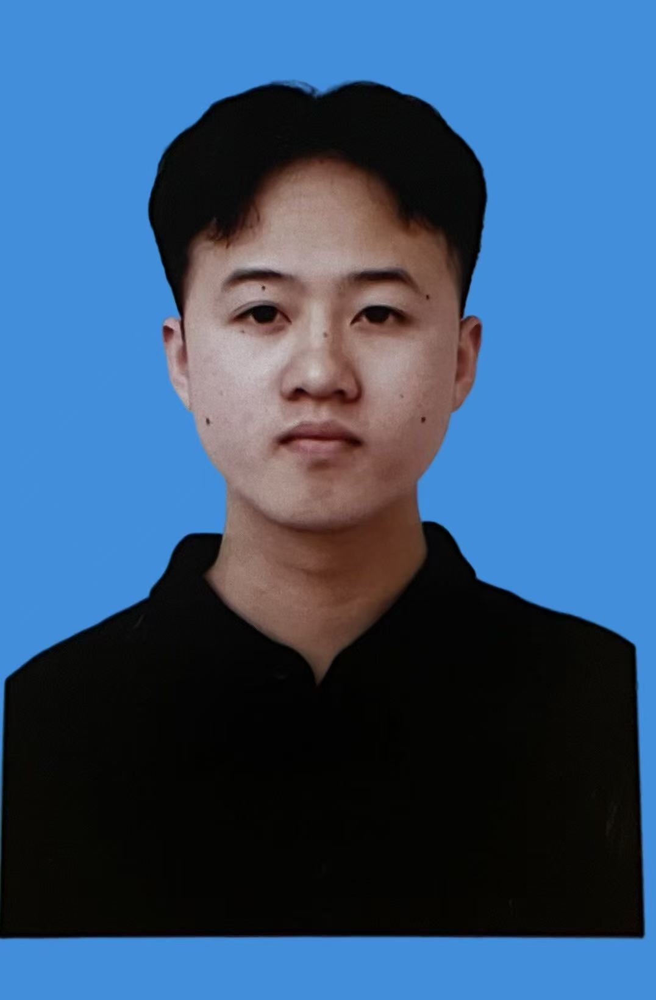

# Lab 12 Final Project

## Personal Information

**Name:** Chen WenYi (Lucian Chen)

**Student ID:** 20242178

**Class:** 241 (International Exchange Class)

**Major:** Software Engineering

**University:** North Minzu University & Chiang Mai University

## Photo



## Application URLs

| Application | URL |
|-------------|-----|
| Personal Website | http://98.89.48.43:8080 |
| Todo Application | http://98.89.48.43:8081 |

## Project Structure

```
.
├── .github/workflows/
│   └── deploy.yml          # GitHub Actions CI/CD
├── website/                 # Personal website
│   ├── Dockerfile
│   ├── index.html
│   ├── profile.html
│   ├── CAMTinfo.html
│   ├── Myself.jpg
│   ├── CAMT.jpeg
│   └── NMU.png
├── todo-app/                # TodoMVC React application
│   ├── Dockerfile
│   └── index.html
├── docker-compose.yml       # Multi-container orchestration
└── README.md
```

## Deployment

This project is deployed on **AWS Lightsail** using Docker Compose.
Both applications are built and deployed on the same server via GitHub Actions CI/CD.

_Last verified: 23 June 2026_
